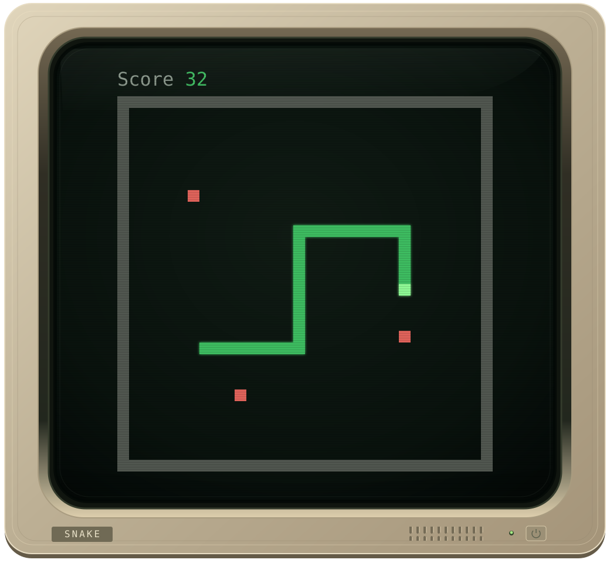

[](https://codecov.io/gh/NLipatov/snake)

# snake 🐍

<p align="center">
  
</p>

⚡ Blazing fast Snake game in Rust for terminal and WebAssembly-powered web.

It comes in 2 flavours:
- Terminal (Installation required)
- WASM (Available at https://snake.ethacore.com)

## Controls

### Web

- Arrow keys: move on desktop
- On-screen `D-pad`: move on phones and tablets
- `Space`: pause/resume on desktop
- `Esc`: restart on desktop
- `Restart` button or `D-pad`: restart after game over on touch devices

### Terminal

- Arrow keys: move
- `Space`: pause/resume
- `Esc`: quit

## Install TUI version

Download a prebuilt binary for your platform. No Rust toolchain is required.

Linux binaries are statically linked with musl and do not require glibc.

On Linux and macOS, the commands install to `~/.local/bin`. Run `~/.local/bin/snake`,
or `snake` if that directory is already in your `PATH`.

### Linux ARM64

```bash
snake_release=$(curl -fsSL -o /dev/null -w '%{url_effective}' https://github.com/NLipatov/snake/releases/latest) &&
mkdir -p "$HOME/.local/bin" &&
curl -fsSL "https://github.com/NLipatov/snake/releases/download/${snake_release##*/}/snake-${snake_release##*/}-aarch64-unknown-linux-musl.tar.gz" |
  tar -xz -C "$HOME/.local/bin" snake
```

### Linux AMD64

```bash
snake_release=$(curl -fsSL -o /dev/null -w '%{url_effective}' https://github.com/NLipatov/snake/releases/latest) &&
mkdir -p "$HOME/.local/bin" &&
curl -fsSL "https://github.com/NLipatov/snake/releases/download/${snake_release##*/}/snake-${snake_release##*/}-x86_64-unknown-linux-musl.tar.gz" |
  tar -xz -C "$HOME/.local/bin" snake
```

### macOS ARM64 (Apple Silicon)

```bash
snake_release=$(curl -fsSL -o /dev/null -w '%{url_effective}' https://github.com/NLipatov/snake/releases/latest) &&
mkdir -p "$HOME/.local/bin" &&
curl -fsSL "https://github.com/NLipatov/snake/releases/download/${snake_release##*/}/snake-${snake_release##*/}-aarch64-apple-darwin.tar.gz" |
  tar -xz -C "$HOME/.local/bin" snake
```

### macOS AMD64 (Intel)

```bash
snake_release=$(curl -fsSL -o /dev/null -w '%{url_effective}' https://github.com/NLipatov/snake/releases/latest) &&
mkdir -p "$HOME/.local/bin" &&
curl -fsSL "https://github.com/NLipatov/snake/releases/download/${snake_release##*/}/snake-${snake_release##*/}-x86_64-apple-darwin.tar.gz" |
  tar -xz -C "$HOME/.local/bin" snake
```

### Windows

Download the archive for your architecture from the [latest release](https://github.com/NLipatov/snake/releases/latest), extract it, and run `snake.exe`:

- ARM64: `snake-<version>-aarch64-pc-windows-msvc.zip`
- AMD64: `snake-<version>-x86_64-pc-windows-msvc.zip`

## Build from source

Requires [Rust](https://www.rust-lang.org/tools/install) and Git.

```bash
git clone https://github.com/NLipatov/snake.git
cd snake
```

### Run in Terminal

```bash
cargo run --release
```

### Run in Browser

Requires [wasm-pack](https://rustwasm.github.io/wasm-pack/installer/) and Python 3.

Build the WebAssembly bundle into `web/pkg`:

```bash
wasm-pack build --target web --out-dir web/pkg
```

Serve the static `web` directory:

```bash
python3 -m http.server --directory web 8000
```

Then open `http://localhost:8000`.
